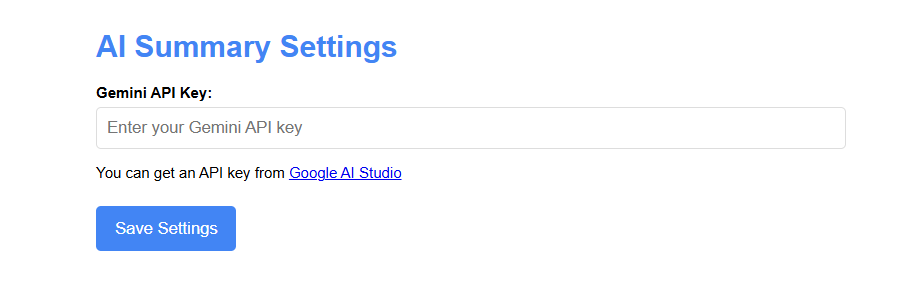
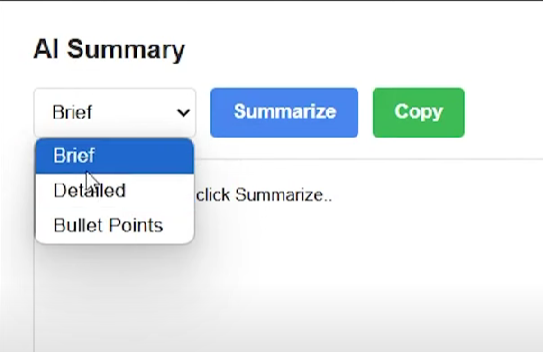
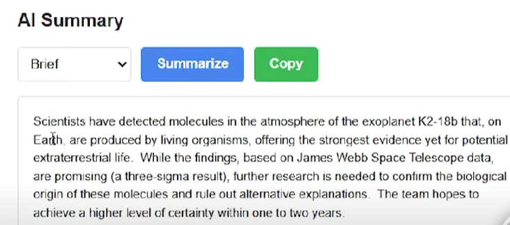
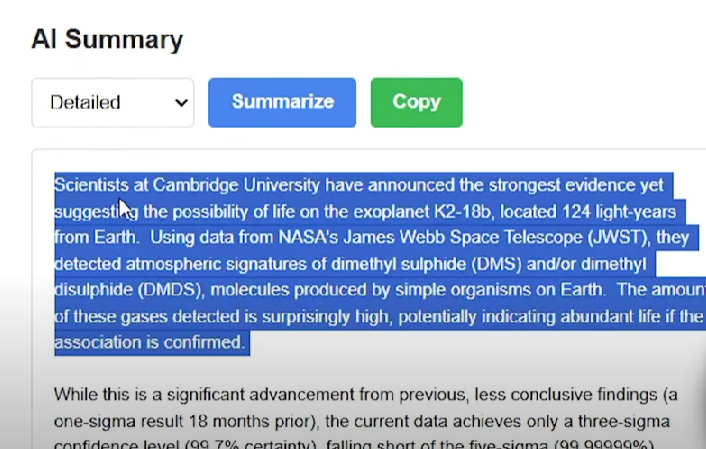
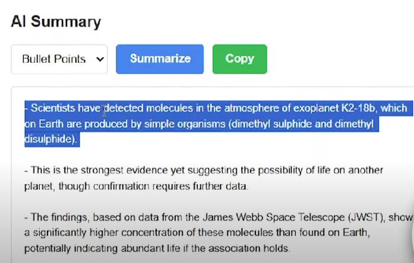

# AI Article Summarizer

**AI Article Summarizer** is a browser-based tool that uses **Google Gemini AI** to summarize any article in three different modes: **Brief**, **Detail**, and **Bullet Points**. Users can choose how they want the summary displayed by selecting a mode and clicking the **Summarize** button.

## Features

- Summarize articles in three modes:
  - **Brief**: Short, concise summary
  - **Detail**: In-depth explanation
  - **Bullet Points**: Main points in a bulleted list
- Clean and simple UI
- Uses **Google Gemini API**
- Completely **free** to use

## Tech Stack

- HTML  
- CSS  
- JavaScript  
- Google Gemini API

## Installation

1. Download or clone this repository.
2. Open the Chrome browser and go to `chrome://extensions/`.
3. Enable **Developer Mode**.
4. Click on **Load unpacked** and select the project folder.
5. The extension will now be active in your browser.

## Usage

1. Open any article you want to summarize.
2. Click the extension icon in your browser.
3. Select one of the three summary modes: Brief, Detail, or Bullet Points.
4. Click **Summarize**.
5. The summary will be displayed according to your selected mode.

> ## First Time login required Google Gemini API key setup . Google Gemini is free to use.

## Screenshots
## Login Api First time

## Select Point

## Brief Summ..

## Details

## Bullet Points

